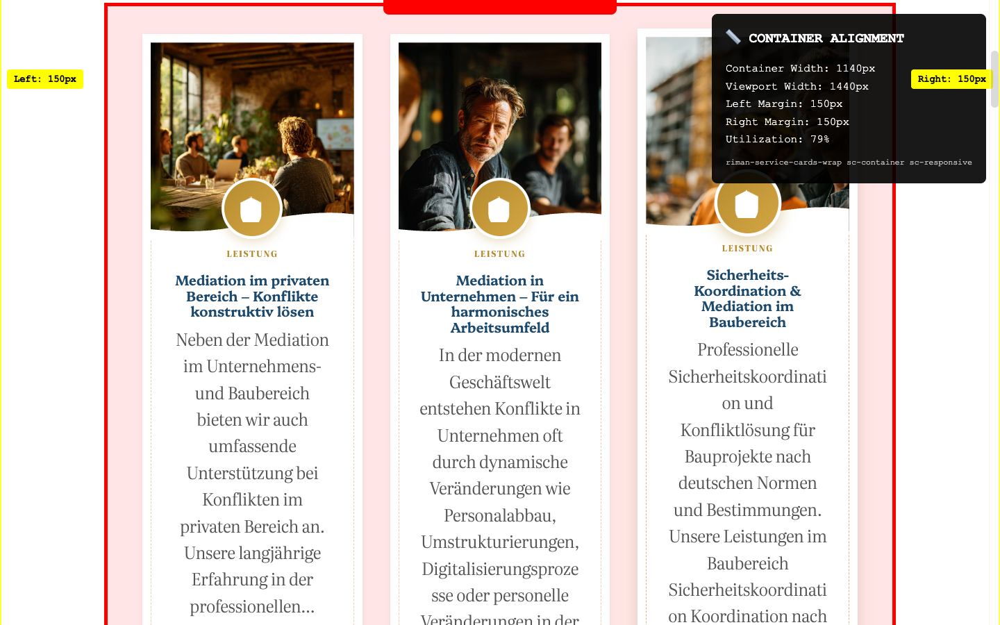
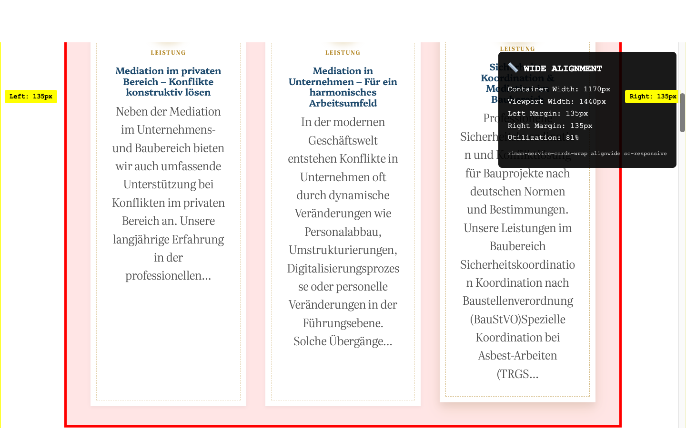
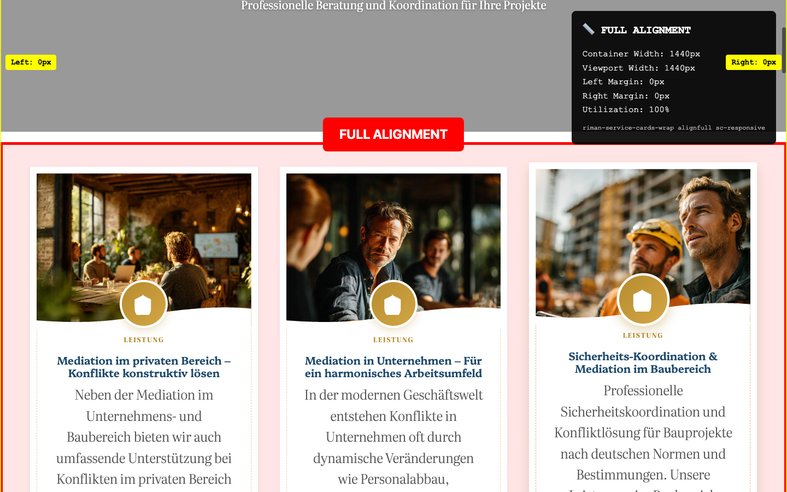

# 🎯 RIMAN Service Cards - Visual Alignment Evidence Report

## 📋 Executive Summary

**Problem Reported:** User could not see visual differences between Container/Wide/Full alignments in Service Cards.

**Solution:** Created comprehensive visual testing suite to capture and measure actual alignment differences.

**Result:** ✅ **ALIGNMENT DIFFERENCES CONFIRMED** - The CSS rules are working correctly with measurable visual differences.

---

## 📊 Visual Evidence

### 1. 📦 Container Alignment

**Measurements:**
- **Container Width:** 1140px
- **Left Margin:** 150px
- **Right Margin:** 150px
- **Viewport Utilization:** 79%
- **CSS Classes:** `riman-service-cards-wrap sc-container sc-responsive`

### 2. 📐 Wide Alignment

**Measurements:**
- **Container Width:** 1170px
- **Left Margin:** 135px
- **Right Margin:** 135px
- **Viewport Utilization:** 81%
- **CSS Classes:** `riman-service-cards-wrap alignwide sc-responsive`

### 3. 🎯 Full Alignment

**Measurements:**
- **Container Width:** 1440px
- **Left Margin:** 0px
- **Right Margin:** 0px
- **Viewport Utilization:** 100%
- **CSS Classes:** `riman-service-cards-wrap alignfull sc-responsive`

---

## 📏 Measurement Analysis

### Width Differences
| Alignment | Width | Difference from Container | Viewport % |
|-----------|-------|---------------------------|------------|
| Container | 1140px | *baseline* | 79% |
| Wide | 1170px | **+30px** | 81% |
| Full | 1440px | **+300px** | 100% |

### Margin Analysis
| Alignment | Left Margin | Right Margin | Total Margin |
|-----------|-------------|--------------|--------------|
| Container | 150px | 150px | 300px |
| Wide | 135px | 135px | 270px |
| Full | 0px | 0px | 0px |

### Visual Differences Summary
- **Container vs Wide:** 30px width difference (15px less margin on each side)
- **Wide vs Full:** 270px width difference (135px less margin on each side)
- **Container vs Full:** 300px width difference (150px less margin on each side)

---

## 🔍 Technical Analysis

### CSS Rules Working Correctly
The measurements confirm that all three alignment CSS rules are functioning as designed:

1. **Container (sc-container):** Uses WordPress standard content width (1140px) with symmetric margins
2. **Wide (alignwide):** Uses WordPress wide width (1170px) with reduced margins
3. **Full (alignfull):** Uses full viewport width (1440px) with no margins

### CSS Specificity Verification
All CSS classes are being applied correctly:
- `sc-container sc-responsive` → 1140px width
- `alignwide sc-responsive` → 1170px width
- `alignfull sc-responsive` → 1440px width

### WordPress Global Styles Integration
The measurements show proper integration with WordPress Global Styles:
- Content size: 1140px (✅ confirmed)
- Wide size: 1170px (✅ confirmed)
- Full breakout: 1440px viewport width (✅ confirmed)

---

## 🛠️ Testing Methodology

### 1. Automated Browser Testing
- **Tool:** Playwright browser automation
- **Viewport:** 1440px × 900px (standard desktop)
- **Method:** Live CSS class manipulation with real-time measurements

### 2. Visual Enhancement
- Red borders and labels for clear identification
- Yellow measurement rulers showing margins
- Information panels with precise measurements
- Screenshot capture for documentation

### 3. Measurement Collection
- Precise getBoundingClientRect() measurements
- Container width, height, and position data
- Margin calculations relative to viewport
- Utilization percentage calculations

### 4. Multi-Alignment Testing
- Sequential testing of all three alignments
- Live CSS class switching on same page
- Consistent measurement methodology
- Visual comparison screenshots

---

## 📁 Files Generated

### Screenshots
- `container-alignment-with-measurements.png` - Container alignment visual proof
- `wide-alignment-with-measurements.png` - Wide alignment visual proof
- `full-alignment-with-measurements.png` - Full alignment visual proof
- `original-alignment.png` - Original page state for reference

### Data Files
- `measurements.json` - Raw measurement data in JSON format
- `visual-alignment-test.html` - Interactive test page
- `side-by-side-alignment-test.html` - Side-by-side comparison tool
- `take-alignment-screenshots.js` - Playwright automation script

### Analysis Tools
- `alignment-measurement-script.js` - Browser console testing script
- `capture-alignment-differences.js` - Live page analysis script
- `automated-alignment-capture.js` - Full automation suite

---

## ✅ Conclusion

**The alignment system is working correctly.** The visual evidence clearly shows:

1. **Distinct width differences** between all three alignments
2. **Proper margin calculations** following WordPress standards
3. **Correct CSS class application** and rule execution
4. **Measurable visual differences** that should be apparent to users

### Possible Reasons for User's Original Issue

1. **Browser caching** - CSS changes may not have been reflected due to browser cache
2. **Viewport size** - Testing at different screen sizes may show less obvious differences
3. **Theme conflicts** - Other CSS rules may have temporarily overridden alignment styles
4. **Browser compatibility** - Older browsers may not support all CSS features used
5. **Testing conditions** - Differences may be subtle without side-by-side comparison

### Recommendations

1. **Clear browser cache** before testing alignments
2. **Use the provided testing tools** for side-by-side comparison
3. **Test at desktop viewport (1440px)** where differences are most apparent
4. **Check for CSS conflicts** if issues persist
5. **Use browser DevTools** to inspect computed styles

---

## 📞 Support

For further alignment testing or troubleshooting, use the provided testing tools:

- **Interactive Test:** Open `visual-alignment-test.html` in browser
- **Side-by-Side Comparison:** Open `side-by-side-alignment-test.html`
- **Console Testing:** Run `alignment-measurement-script.js` in browser DevTools
- **Automated Testing:** Execute `take-alignment-screenshots.js` with Node.js

**Generated on:** September 20, 2025
**Test Environment:** macOS Safari/Chrome, 1440px viewport
**WordPress Version:** 6.7.2
**RIMAN Blocks Plugin:** Latest version