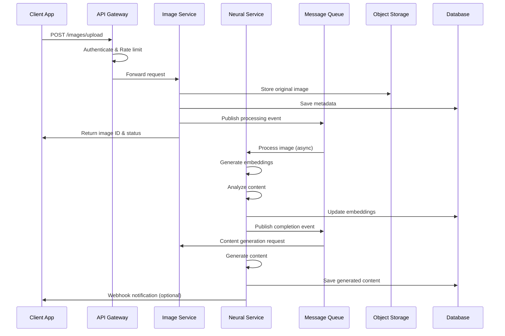
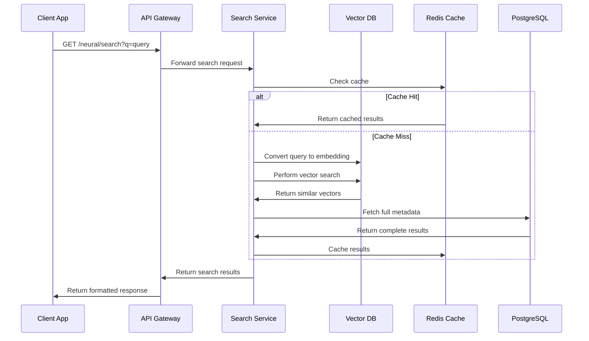
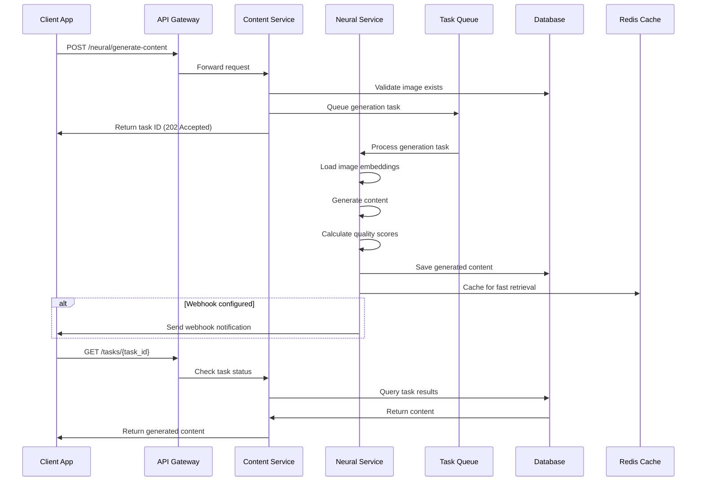
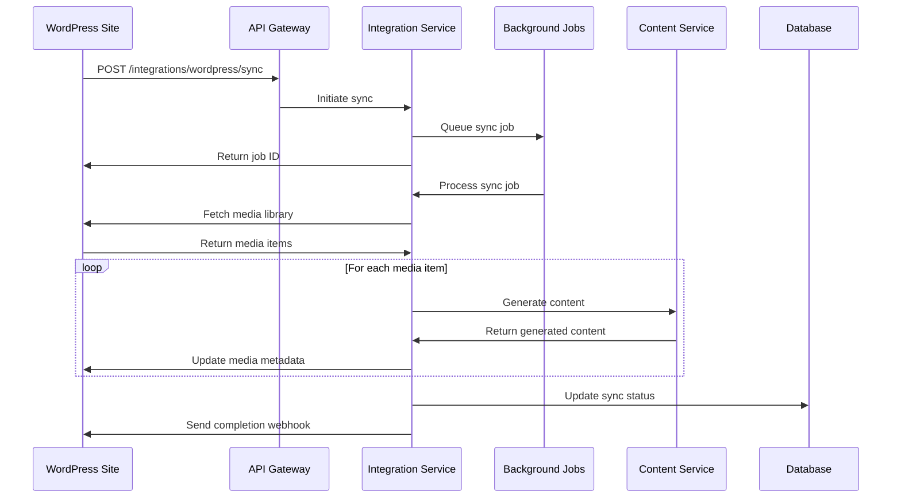

# API Specifications and Data Flow Patterns

## Overview
This document defines the comprehensive API specifications and data flow patterns for the RIMAN system, ensuring seamless integration between components, external services, and client applications.

## API Architecture Overview

```
┌─────────────────────────────────────────────────────────────────────────────────┐
│                              API ARCHITECTURE                                  │
├─────────────────────────────────────────────────────────────────────────────────┤
│                                                                                 │
│  CLIENT LAYER                                                                   │
│  ┌─────────────────┐  ┌─────────────────┐  ┌─────────────────────────────────┐  │
│  │ Web Dashboard   │  │ Mobile App      │  │ Third-party Integrations        │  │
│  │                 │  │                 │  │                                 │  │
│  │ • React SPA     │  │ • React Native  │  │ • WordPress Plugin             │  │
│  │ • TypeScript    │  │ • REST Client   │  │ • External APIs                │  │
│  │ • GraphQL       │  │ • WebSocket     │  │ • Webhook Consumers            │  │
│  └─────────────────┘  └─────────────────┘  └─────────────────────────────────┘  │
│           │                       │                       │                      │
│           └───────────────────────┼───────────────────────┘                      │
│                                   ▼                                              │
│                                                                                 │
│  API GATEWAY LAYER                                                              │
│  ┌─────────────────────────────────────────────────────────────────────────────┐ │
│  │                        KONG API GATEWAY                                    │ │
│  │                                                                             │ │
│  │  ┌─────────────────┐  ┌─────────────────┐  ┌─────────────────────────────┐  │ │
│  │  │ Authentication  │  │ Rate Limiting   │  │ Load Balancing              │  │ │
│  │  │                 │  │                 │  │                             │  │ │
│  │  │ • JWT Validation│  │ • Per User      │  │ • Round Robin               │  │ │
│  │  │ • OAuth2/OIDC   │  │ • Per IP        │  │ • Health Checks             │  │ │
│  │  │ • API Key Auth  │  │ • Per Endpoint  │  │ • Circuit Breaker           │  │ │
│  │  └─────────────────┘  └─────────────────┘  └─────────────────────────────┘  │ │
│  │                                   │                                         │ │
│  │  ┌─────────────────┐  ┌───────────┼─────────┐  ┌─────────────────────────┐  │ │
│  │  │ Request/Response│  │ Logging & │         │  │ Protocol Translation    │  │ │
│  │  │ Transformation  │  │ Analytics │         │  │                         │  │ │
│  │  │                 │  │           │         │  │ • REST ↔ GraphQL        │  │ │
│  │  │ • Schema Valid  │  │ • Metrics │         │  │ • gRPC ↔ REST           │  │ │
│  │  │ • Data Format   │  │ • Tracing │         │  │ • WebSocket ↔ HTTP      │  │ │
│  │  │ • Error Handling│  │ • Audit   │         │  │ • Protocol Buffers      │  │ │
│  │  └─────────────────┘  └───────────┼─────────┘  └─────────────────────────┘  │ │
│  └─────────────────────────────────────┼─────────────────────────────────────────┘ │
│                                        │                                           │
│                                        ▼                                           │
│                                                                                 │
│  SERVICE MESH LAYER                                                             │
│  ┌─────────────────────────────────────────────────────────────────────────────┐ │
│  │                            ISTIO SERVICE MESH                              │ │
│  │                                                                             │ │
│  │  ┌─────────────────┐  ┌─────────────────┐  ┌─────────────────────────────┐  │ │
│  │  │ Traffic Routing │  │ Security        │  │ Observability               │  │ │
│  │  │                 │  │                 │  │                             │  │ │
│  │  │ • Canary        │  │ • mTLS          │  │ • Distributed Tracing       │  │ │
│  │  │ • A/B Testing   │  │ • RBAC          │  │ • Metrics Collection        │  │ │
│  │  │ • Blue/Green    │  │ • Network Pol   │  │ • Log Aggregation           │  │ │
│  │  └─────────────────┘  └─────────────────┘  └─────────────────────────────┘  │ │
│  └─────────────────────────────────────────────────────────────────────────────┘ │
│                                        │                                           │
│                                        ▼                                           │
│                                                                                 │
│  MICROSERVICES LAYER                                                            │
│  ┌─────────────────────────────────────────────────────────────────────────────┐ │
│  │                          CORE SERVICES                                     │ │
│  │                                                                             │ │
│  │  ┌─────────────────┐  ┌─────────────────┐  ┌─────────────────────────────┐  │ │
│  │  │ Image Service   │  │ Neural Service  │  │ Content Service             │  │ │
│  │  │                 │  │                 │  │                             │  │ │
│  │  │ • REST API      │  │ • gRPC API      │  │ • GraphQL API               │  │ │
│  │  │ • Upload/Store  │  │ • ML Inference  │  │ • Text Generation           │  │ │
│  │  │ • Validation    │  │ • Embeddings    │  │ • Template Engine           │  │ │
│  │  └─────────────────┘  └─────────────────┘  └─────────────────────────────┘  │ │
│  │                                                                             │ │
│  │  ┌─────────────────┐  ┌─────────────────┐  ┌─────────────────────────────┐  │ │
│  │  │ Search Service  │  │ User Service    │  │ Integration Service         │  │ │
│  │  │                 │  │                 │  │                             │  │ │
│  │  │ • Vector Search │  │ • Auth/Auth     │  │ • WordPress API             │  │ │
│  │  │ • Semantic Query│  │ • Profile Mgmt  │  │ • Third-party APIs          │  │ │
│  │  │ • Indexing      │  │ • Preferences   │  │ • Webhook Management        │  │ │
│  │  └─────────────────┘  └─────────────────┘  └─────────────────────────────┘  │ │
│  └─────────────────────────────────────────────────────────────────────────────┘ │
│                                        │                                           │
│                                        ▼                                           │
│                                                                                 │
│  DATA LAYER                                                                     │
│  ┌─────────────────────────────────────────────────────────────────────────────┐ │
│  │                            DATA SERVICES                                   │ │
│  │                                                                             │ │
│  │  ┌─────────────────┐  ┌─────────────────┐  ┌─────────────────────────────┐  │ │
│  │  │ PostgreSQL      │  │ Redis Cache     │  │ Vector Database             │  │ │
│  │  │ (Primary DB)    │  │                 │  │ (Pinecone/Weaviate)         │  │ │
│  │  └─────────────────┘  └─────────────────┘  └─────────────────────────────┘  │ │
│  │                                                                             │ │
│  │  ┌─────────────────┐  ┌─────────────────┐  ┌─────────────────────────────┐  │ │
│  │  │ Object Storage  │  │ Message Queue   │  │ Time Series DB              │  │ │
│  │  │ (S3/MinIO)      │  │ (Apache Kafka)  │  │ (InfluxDB)                  │  │ │
│  │  └─────────────────┘  └─────────────────┘  └─────────────────────────────┘  │ │
│  └─────────────────────────────────────────────────────────────────────────────┘ │
└─────────────────────────────────────────────────────────────────────────────────┘
```

## Core API Specifications

### 1. Image Management API

#### 1.1 Upload Image
```yaml
POST /api/v1/images/upload

Content-Type: multipart/form-data

Request:
  file: binary (image file)
  metadata: JSON
    title: string (optional)
    description: string (optional)
    tags: string[] (optional)
    category: string (optional)
    visibility: enum [public, private] (default: private)

Response:
  201 Created:
    id: string (UUID)
    filename: string
    size: number (bytes)
    mime_type: string
    dimensions:
      width: number
      height: number
    upload_url: string (temporary)
    thumbnail_url: string
    metadata:
      created_at: datetime
      modified_at: datetime
      etag: string
    processing_status: enum [pending, processing, completed, failed]
    
  400 Bad Request:
    error: string
    details: object
    
  413 Payload Too Large:
    error: "File size exceeds maximum allowed size"
    max_size: string

Rate Limiting: 100 requests/minute per user
Authentication: JWT token required
```

#### 1.2 Get Image Details
```yaml
GET /api/v1/images/{id}

Parameters:
  id: string (UUID) - Image identifier
  include: string[] (optional) - Additional data to include
    Options: [metadata, embeddings, content, analytics]

Response:
  200 OK:
    id: string
    filename: string
    urls:
      original: string
      thumbnail: string
      medium: string
      large: string
    metadata:
      size: number
      mime_type: string
      dimensions: object
      exif: object (if available)
    embeddings:
      visual: number[] (512-dim vector)
      semantic: number[] (512-dim vector)
    generated_content:
      title: string
      description: string
      tags: string[]
      alt_text: string
      seo_title: string
      seo_description: string
    analytics:
      views: number
      downloads: number
      usage_contexts: object[]
    created_at: datetime
    updated_at: datetime
    
  404 Not Found:
    error: "Image not found"
    
Rate Limiting: 1000 requests/minute per user
Authentication: JWT token required
```

### 2. Neural Processing API

#### 2.1 Generate Content from Image
```yaml
POST /api/v1/neural/generate-content

Content-Type: application/json

Request:
  image_id: string (UUID)
  options:
    content_type: enum [title, description, tags, alt_text, seo, full]
    tone: enum [professional, casual, creative, technical]
    length: enum [short, medium, long, custom]
    custom_length: number (if length=custom)
    language: string (ISO 639-1, default: "en")
    context: object
      website_type: enum [blog, ecommerce, portfolio, corporate]
      target_audience: string
      industry: string
    template_id: string (optional)
    
Response:
  200 OK:
    task_id: string (UUID)
    status: enum [queued, processing, completed, failed]
    content:
      title: string
      description: string
      tags: string[]
      alt_text: string
      seo:
        title: string
        description: string
        keywords: string[]
    quality_scores:
      relevance: number (0-1)
      creativity: number (0-1)
      seo_score: number (0-100)
      readability: number (0-100)
    processing_time_ms: number
    model_version: string
    
  202 Accepted (async processing):
    task_id: string
    status: "queued"
    estimated_completion: datetime
    webhook_url: string (optional)
    
Rate Limiting: 50 requests/minute per user
Authentication: JWT token required
```

#### 2.2 Semantic Search
```yaml
GET /api/v1/neural/search

Parameters:
  q: string - Search query
  image_id: string (optional) - Find similar images
  embedding: number[] (optional) - Direct vector search
  filters:
    mime_types: string[] (optional)
    size_range: object (optional)
      min: number
      max: number
    date_range: object (optional)
      start: datetime
      end: datetime
    tags: string[] (optional)
    categories: string[] (optional)
  limit: number (default: 20, max: 100)
  offset: number (default: 0)
  sort: enum [relevance, date, size, popularity]
  include_scores: boolean (default: false)

Response:
  200 OK:
    results: object[]
      id: string
      filename: string
      thumbnail_url: string
      similarity_score: number (if include_scores=true)
      generated_content:
        title: string
        description: string
        tags: string[]
      metadata: object
    total_count: number
    has_more: boolean
    search_metadata:
      query_processing_time_ms: number
      vector_search_time_ms: number
      total_time_ms: number
      
Rate Limiting: 200 requests/minute per user
Authentication: JWT token required
```

### 3. Content Management API

#### 3.1 Create/Update Content
```yaml
PUT /api/v1/content/{image_id}

Content-Type: application/json

Request:
  title: string
  description: string
  tags: string[]
  alt_text: string
  category: string
  seo:
    title: string
    description: string
    keywords: string[]
    canonical_url: string (optional)
  custom_fields: object (optional)
  workflow_status: enum [draft, review, approved, published]
  
Response:
  200 OK:
    id: string
    image_id: string
    content: object (echoed request data)
    quality_scores:
      seo_score: number (0-100)
      readability_score: number (0-100)
      keyword_density: object
    validation_results:
      issues: string[]
      suggestions: string[]
    updated_at: datetime
    version: number
    
Rate Limiting: 500 requests/minute per user
Authentication: JWT token required
```

### 4. Integration API

#### 4.1 WordPress Integration
```yaml
POST /api/v1/integrations/wordpress/sync

Content-Type: application/json

Request:
  wp_site_url: string
  wp_api_key: string (encrypted)
  sync_options:
    media_library: boolean (default: true)
    posts: boolean (default: false)
    pages: boolean (default: false)
    auto_generate: boolean (default: true)
  filters:
    date_range: object (optional)
    categories: string[] (optional)
    post_types: string[] (optional)
    
Response:
  202 Accepted:
    sync_job_id: string
    status: "initiated"
    estimated_completion: datetime
    progress_url: string
    
  400 Bad Request:
    error: "Invalid WordPress credentials"
    
Rate Limiting: 10 requests/hour per user
Authentication: JWT token required
```

## Data Flow Patterns

### 1. Image Upload and Processing Flow



### 2. Semantic Search Flow



### 3. Content Generation Flow



### 4. WordPress Integration Flow



## Error Handling Patterns

### 1. Standardized Error Format
```json
{
  "error": {
    "code": "VALIDATION_ERROR",
    "message": "Request validation failed",
    "details": {
      "field": "image_id",
      "reason": "Invalid UUID format",
      "provided": "invalid-uuid"
    },
    "trace_id": "550e8400-e29b-41d4-a716-446655440000",
    "timestamp": "2024-01-15T10:30:00Z"
  }
}
```

### 2. Error Code Categories
```yaml
Client Errors (4xx):
  400 - BAD_REQUEST: Invalid request format/data
  401 - UNAUTHORIZED: Authentication required/failed
  403 - FORBIDDEN: Insufficient permissions
  404 - NOT_FOUND: Resource doesn't exist
  409 - CONFLICT: Resource conflict/duplicate
  413 - PAYLOAD_TOO_LARGE: File size exceeds limit
  429 - RATE_LIMIT_EXCEEDED: Too many requests

Server Errors (5xx):
  500 - INTERNAL_ERROR: Unexpected server error
  502 - BAD_GATEWAY: Upstream service error
  503 - SERVICE_UNAVAILABLE: Service temporarily down
  504 - GATEWAY_TIMEOUT: Request timeout
```

### 3. Retry Strategies
```yaml
Automatic Retry:
  Strategy: Exponential backoff with jitter
  Max Attempts: 3
  Base Delay: 1s
  Max Delay: 30s
  Retryable Errors: [500, 502, 503, 504, network errors]
  
Circuit Breaker:
  Failure Threshold: 50%
  Request Volume Threshold: 20
  Sleep Window: 60s
  Success Threshold: 3
```

## Rate Limiting Strategy

### 1. Rate Limiting Tiers
```yaml
Free Tier:
  Requests: 1,000/hour
  Image Uploads: 50/day
  Storage: 1GB
  Neural Processing: 100/day

Professional Tier:
  Requests: 10,000/hour
  Image Uploads: 1,000/day
  Storage: 100GB
  Neural Processing: 2,000/day

Enterprise Tier:
  Requests: 100,000/hour
  Image Uploads: Unlimited
  Storage: 1TB+
  Neural Processing: 50,000/day
```

### 2. Rate Limiting Headers
```http
X-RateLimit-Limit: 1000
X-RateLimit-Remaining: 999
X-RateLimit-Reset: 1609459200
X-RateLimit-Retry-After: 3600 (when rate limited)
```

## Security Specifications

### 1. Authentication Flow
```yaml
JWT Token Structure:
  Header:
    alg: RS256
    typ: JWT
    
  Payload:
    iss: "https://api.riman.ai"
    sub: user_id
    aud: "riman-api"
    exp: expiration_timestamp
    iat: issued_at_timestamp
    scope: "read:images write:images process:neural"
    
  Signature: RSA256 signature
```

### 2. API Key Management
```yaml
API Key Types:
  Read-Only: GET operations only
  Write: POST, PUT, DELETE operations
  Admin: All operations + user management
  
Key Rotation:
  Automatic: Every 90 days
  Manual: On-demand via dashboard
  
Key Restrictions:
  IP Whitelist: Restrict to specific IPs
  Domain Whitelist: Restrict to specific domains
  Time-based: Temporary keys with TTL
```

## Monitoring and Analytics

### 1. API Metrics
```yaml
Core Metrics:
  - Request rate (req/sec)
  - Response time (p50, p95, p99)
  - Error rate by status code
  - Throughput by endpoint
  - Authentication success/failure rate
  
Business Metrics:
  - Images processed per day
  - Content generation success rate
  - User engagement with generated content
  - API adoption by endpoint
  
Performance Metrics:
  - Database query time
  - Cache hit/miss ratio
  - Neural model inference time
  - Queue processing time
```

### 2. Health Checks
```yaml
Health Check Endpoints:
  GET /health/live:
    Purpose: Liveness probe
    Response: 200 OK / 503 Service Unavailable
    
  GET /health/ready:
    Purpose: Readiness probe
    Checks: Database, Cache, Queue connectivity
    
  GET /health/startup:
    Purpose: Startup probe
    Checks: Service initialization complete
    
Health Check Response:
  status: "healthy" | "unhealthy" | "degraded"
  timestamp: datetime
  checks:
    database: "passed" | "failed"
    cache: "passed" | "failed"
    queue: "passed" | "failed"
    storage: "passed" | "failed"
  response_time_ms: number
```

This comprehensive API specification provides a solid foundation for building scalable, maintainable, and secure APIs that support the complex workflows of semantic image-content mapping while maintaining excellent developer experience.