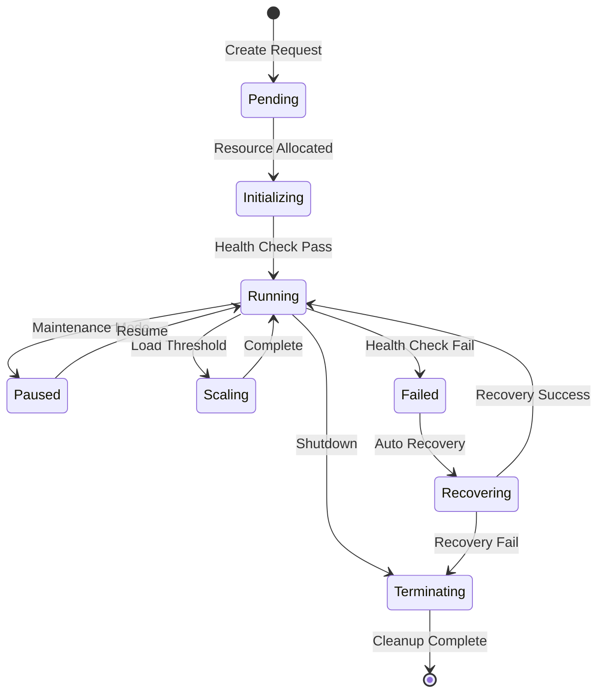

# DAA (Dynamic Agent Architecture) Coordination Layer

## Overview
The DAA Coordination Layer provides intelligent, self-organizing agent management for the RIMAN system, enabling dynamic scaling, fault tolerance, and optimal resource allocation across distributed processing agents.

## Architecture Diagram

```
┌─────────────────────────────────────────────────────────────────────────────────┐
│                        DAA COORDINATION ARCHITECTURE                           │
├─────────────────────────────────────────────────────────────────────────────────┤
│                                                                                 │
│  CONTROL PLANE                                                                  │
│  ┌─────────────────────────────────────────────────────────────────────────────┐ │
│  │                        SWARM ORCHESTRATOR                                   │ │
│  │                                                                             │ │
│  │  ┌─────────────────┐  ┌─────────────────┐  ┌─────────────────────────────┐  │ │
│  │  │ Cluster Manager │  │ Topology Manager│  │ Resource Governor           │  │ │
│  │  │                 │  │                 │  │                             │  │ │
│  │  │ • Node Discovery│  │ • Mesh/Ring/Star│  │ • CPU/Memory/GPU Allocation │  │ │
│  │  │ • Health Checks │  │ • Adaptive Topo │  │ • QoS Management            │  │ │
│  │  │ • Leader Election│  │ • Load Balancing│  │ • Cost Optimization         │  │ │
│  │  │ • Failover      │  │ • Auto-scaling  │  │ • Resource Quotas           │  │ │
│  │  └─────────────────┘  └─────────────────┘  └─────────────────────────────┘  │ │
│  │                                   │                                         │ │
│  │  ┌─────────────────┐  ┌───────────┼─────────┐  ┌─────────────────────────┐  │ │
│  │  │ Task Scheduler  │  │ Consensus │         │  │ Performance Monitor     │  │ │
│  │  │                 │  │ Engine    │         │  │                         │  │ │
│  │  │ • Priority Queue│  │           │         │  │ • Real-time Metrics     │  │ │
│  │  │ • Dependency    │  │ • Raft    │         │  │ • SLA Monitoring        │  │ │
│  │  │   Resolution    │  │ • PBFT    │         │  │ • Anomaly Detection     │  │ │
│  │  │ • Load          │  │ • Gossip  │         │  │ • Predictive Scaling    │  │ │
│  │  │   Distribution  │  │ Protocol  │         │  │                         │  │ │
│  │  └─────────────────┘  └───────────┼─────────┘  └─────────────────────────┘  │ │
│  └─────────────────────────────────────┼─────────────────────────────────────────┘ │
│                                        │                                           │
│                                        ▼                                           │
│                                                                                 │
│  COORDINATION PLANE                                                             │
│  ┌─────────────────────────────────────────────────────────────────────────────┐ │
│  │                        AGENT COORDINATION HUB                              │ │
│  │                                                                             │ │
│  │  ┌─────────────────┐  ┌─────────────────┐  ┌─────────────────────────────┐  │ │
│  │  │ Agent Registry  │  │ Message Bus     │  │ State Synchronizer          │  │ │
│  │  │                 │  │                 │  │                             │  │ │
│  │  │ • Agent         │  │ • Pub/Sub       │  │ • Distributed State Store   │  │ │
│  │  │   Catalog       │  │ • Request/Reply │  │ • Vector Clocks             │  │ │
│  │  │ • Capability    │  │ • Event Stream  │  │ • CRDT Operations           │  │ │
│  │  │   Matching      │  │ • Dead Letter   │  │ • Conflict Resolution       │  │ │
│  │  │ • Lifecycle     │  │   Queue         │  │                             │  │ │
│  │  │   Management    │  │                 │  │                             │  │ │
│  │  └─────────────────┘  └─────────────────┘  └─────────────────────────────┘  │ │
│  │                                   │                                         │ │
│  │  ┌─────────────────┐  ┌───────────┼─────────┐  ┌─────────────────────────┐  │ │
│  │  │ Security        │  │ Memory    │         │  │ Circuit Breaker         │  │ │
│  │  │ Manager         │  │ Manager   │         │  │                         │  │ │
│  │  │                 │  │           │         │  │ • Failure Detection     │  │ │
│  │  │ • mTLS          │  │ • Shared  │         │  │ • Auto Recovery         │  │ │
│  │  │ • JWT           │  │   Memory  │         │  │ • Bulkhead Pattern      │  │ │
│  │  │ • RBAC          │  │ • Cache   │         │  │ • Rate Limiting         │  │ │
│  │  │ • Audit Logs    │  │ • TTL     │         │  │                         │  │ │
│  │  └─────────────────┘  └───────────┼─────────┘  └─────────────────────────┘  │ │
│  └─────────────────────────────────────┼─────────────────────────────────────────┘ │
│                                        │                                           │
│                                        ▼                                           │
│                                                                                 │
│  DATA PLANE                                                                     │
│  ┌─────────────────────────────────────────────────────────────────────────────┐ │
│  │                        AGENT EXECUTION ENVIRONMENT                         │ │
│  │                                                                             │ │
│  │  ┌─────────────────────────────────────────────────────────────────────────┐  │ │
│  │  │                        AGENT POOLS                                     │  │ │
│  │  │                                                                         │  │ │
│  │  │  ┌─────────────┐ ┌─────────────┐ ┌─────────────┐ ┌─────────────────┐   │  │ │
│  │  │  │ Image       │ │ Neural      │ │ Content     │ │ Integration     │   │  │ │
│  │  │  │ Agents      │ │ Agents      │ │ Agents      │ │ Agents          │   │  │ │
│  │  │  │             │ │             │ │             │ │                 │   │  │ │
│  │  │  │ • Preproc   │ │ • Inference │ │ • Generation│ │ • WordPress API │   │  │ │
│  │  │  │ • Validation│ │ • Training  │ │ • Templates │ │ • Database      │   │  │ │
│  │  │  │ • Storage   │ │ • Embeddings│ │ • SEO       │ │ • Cache         │   │  │ │
│  │  │  │ • Transform │ │ • Quality   │ │ • Meta      │ │ • Monitoring    │   │  │ │
│  │  │  └─────────────┘ └─────────────┘ └─────────────┘ └─────────────────┘   │  │ │
│  │  │                                                                         │  │ │
│  │  │  ┌─────────────┐ ┌─────────────┐ ┌─────────────┐ ┌─────────────────┐   │  │ │
│  │  │  │ Search      │ │ Quality     │ │ Security    │ │ Analytics       │   │  │ │
│  │  │  │ Agents      │ │ Agents      │ │ Agents      │ │ Agents          │   │  │ │
│  │  │  │             │ │             │ │             │ │                 │   │  │ │
│  │  │  │ • Indexing  │ │ • Validation│ │ • Scanning  │ │ • Metrics       │   │  │ │
│  │  │  │ • Similarity│ │ • Scoring   │ │ • Compliance│ │ • Reporting     │   │  │ │
│  │  │  │ • Ranking   │ │ • Testing   │ │ • Auditing  │ │ • Insights      │   │  │ │
│  │  │  │ • Filtering │ │ • A/B Test  │ │ • Forensics │ │ • Optimization  │   │  │ │
│  │  │  └─────────────┘ └─────────────┘ └─────────────┘ └─────────────────┘   │  │ │
│  │  └─────────────────────────────────────────────────────────────────────────┘  │ │
│  │                                   │                                         │ │
│  │  ┌─────────────────┐  ┌───────────┼─────────┐  ┌─────────────────────────┐  │ │
│  │  │ Container       │  │ Resource  │         │  │ Workload Orchestration  │  │ │
│  │  │ Runtime         │  │ Isolation │         │  │                         │  │ │
│  │  │                 │  │           │         │  │ • Task Queues           │  │ │
│  │  │ • Docker/Podman │  │ • cgroups │         │  │ • Workflow Engine       │  │ │
│  │  │ • Kubernetes    │  │ • namespaces       │  │ • Dependency DAG        │  │ │
│  │  │ • Auto-scaling  │  │ • Network  │        │  │ • Pipeline Execution   │  │ │
│  │  │ • Health Checks │  │   Policies │        │  │                         │  │ │
│  │  └─────────────────┘  └───────────┼─────────┘  └─────────────────────────┘  │ │
│  └─────────────────────────────────────┼─────────────────────────────────────────┘ │
└─────────────────────────────────────────┼─────────────────────────────────────────────┘
                                        │
                                        ▼
┌─────────────────────────────────────────────────────────────────────────────────┐
│                        INFRASTRUCTURE LAYER                                    │
│                                                                                 │
│  ┌─────────────────┐  ┌─────────────────┐  ┌─────────────────────────────────┐  │
│  │ Service Mesh    │  │ Load Balancers  │  │ Observability Stack             │  │
│  │                 │  │                 │  │                                 │  │
│  │ • Istio/Linkerd │  │ • HAProxy/Nginx │  │ • Prometheus/Grafana           │  │
│  │ • Traffic Mgmt  │  │ • Auto-scaling  │  │ • Jaeger/Zipkin                │  │
│  │ • Security      │  │ • Health Checks │  │ • ELK/Loki Stack               │  │
│  │ • Observability │  │ • SSL/TLS       │  │ • Custom Metrics               │  │
│  └─────────────────┘  └─────────────────┘  └─────────────────────────────────┘  │
└─────────────────────────────────────────────────────────────────────────────────┘
```

## Core Components

### 1. Swarm Orchestrator
The central control plane that manages the entire agent ecosystem.

#### Cluster Manager
- **Node Discovery**: Automatic detection and registration of compute nodes
- **Health Monitoring**: Continuous health checks with configurable thresholds
- **Leader Election**: Raft-based leader selection for control plane HA
- **Failover Management**: Automatic failover with sub-second detection

#### Topology Manager
- **Adaptive Topology**: Dynamic topology selection based on workload
- **Load Balancing**: Weighted round-robin with real-time metrics
- **Auto-scaling**: Predictive scaling based on queue depth and latency
- **Network Optimization**: Topology optimization for minimal latency

#### Resource Governor
- **Multi-resource Allocation**: CPU, Memory, GPU, Network bandwidth
- **QoS Enforcement**: Priority-based resource allocation
- **Cost Optimization**: Spot instance management and right-sizing
- **Resource Quotas**: Per-tenant and per-workload limits

### 2. Agent Coordination Hub
The coordination layer that enables seamless agent communication and state management.

#### Agent Registry
```yaml
Agent Catalog Structure:
  agent_id: unique identifier
  type: agent classification
  capabilities: 
    - list of supported operations
  resources:
    cpu: required CPU cores
    memory: required memory (GB)
    gpu: GPU requirements
  health_status: current health
  load_metrics:
    current_load: 0.0-1.0
    queue_depth: number
    avg_latency: milliseconds
  metadata:
    version: agent version
    image: container image
    environment: runtime env vars
```

#### Message Bus Architecture
```yaml
Communication Patterns:
  Request-Reply:
    - Synchronous agent communication
    - Load balancing across replicas
    - Circuit breaker protection
    
  Publish-Subscribe:
    - Event broadcasting
    - Decoupled agent interactions
    - Topic-based routing
    
  Event Streaming:
    - Real-time data processing
    - Event sourcing
    - Replay capabilities
    
  Dead Letter Queue:
    - Failed message handling
    - Debugging and recovery
    - Poison message detection
```

### 3. Distributed State Management
Advanced state synchronization across the distributed system.

#### CRDT (Conflict-free Replicated Data Types)
```python
class SemanticStateCRDT:
    def __init__(self):
        self.state = {
            'image_embeddings': GSet(),  # Grow-only set
            'content_mappings': ORMap(), # Observed-Remove map
            'agent_loads': PNCounter(),  # PN Counter
            'task_queue': ORSet()        # Observed-Remove set
        }
    
    def merge(self, other_state):
        """Merge states from different nodes"""
        for key, value in other_state.items():
            self.state[key] = self.state[key].merge(value)
    
    def add_embedding(self, image_id, embedding):
        self.state['image_embeddings'].add((image_id, embedding))
    
    def update_mapping(self, image_id, content, timestamp):
        self.state['content_mappings'].set(
            image_id, content, timestamp, self.node_id
        )
```

### 4. Consensus Mechanisms

#### Multi-Algorithm Consensus
```yaml
Raft Consensus:
  use_case: Leader election, critical state
  consistency: Strong consistency
  partition_tolerance: CP system
  
Byzantine Fault Tolerance:
  use_case: Untrusted environments
  fault_tolerance: f < n/3 Byzantine faults
  consistency: Strong consistency
  
Gossip Protocol:
  use_case: Membership, monitoring
  consistency: Eventual consistency
  scalability: High scalability
  
Quorum Systems:
  use_case: Distributed operations
  consistency: Configurable (R+W > N)
  availability: High availability
```

### 5. Agent Lifecycle Management

#### Agent States and Transitions


#### Auto-scaling Logic
```python
class AgentAutoScaler:
    def __init__(self):
        self.metrics = {
            'cpu_threshold': 0.7,
            'memory_threshold': 0.8,
            'queue_depth_threshold': 100,
            'latency_threshold': 1000,  # ms
            'scale_up_cooldown': 300,   # seconds
            'scale_down_cooldown': 600  # seconds
        }
    
    def should_scale_up(self, agent_pool):
        return (
            agent_pool.avg_cpu > self.metrics['cpu_threshold'] or
            agent_pool.avg_memory > self.metrics['memory_threshold'] or
            agent_pool.queue_depth > self.metrics['queue_depth_threshold'] or
            agent_pool.avg_latency > self.metrics['latency_threshold']
        )
    
    def calculate_target_replicas(self, current_load, current_replicas):
        target = math.ceil(current_replicas * (current_load / 0.7))
        return max(1, min(target, self.max_replicas))
```

### 6. Security Architecture

#### Zero Trust Security Model
```yaml
Authentication:
  - mTLS between all services
  - JWT tokens with short expiry
  - Certificate rotation
  - Service identity verification

Authorization:
  - RBAC with fine-grained permissions
  - Attribute-based access control
  - Dynamic policy evaluation
  - Audit logging

Network Security:
  - Service mesh (Istio/Linkerd)
  - Network policies
  - Traffic encryption
  - DDoS protection

Data Security:
  - Encryption at rest (AES-256)
  - Encryption in transit (TLS 1.3)
  - Key management (Vault/KMS)
  - Data classification
```

### 7. Performance Optimization

#### Intelligent Load Distribution
```python
class LoadBalancer:
    def __init__(self):
        self.algorithms = {
            'weighted_round_robin': self.weighted_round_robin,
            'least_connections': self.least_connections,
            'resource_aware': self.resource_aware_routing,
            'latency_based': self.latency_based_routing
        }
    
    def resource_aware_routing(self, agents, task):
        # Route based on resource requirements and availability
        suitable_agents = [
            agent for agent in agents 
            if self.can_handle_task(agent, task)
        ]
        
        return min(suitable_agents, 
                  key=lambda a: self.resource_utilization_score(a))
    
    def latency_based_routing(self, agents, client_location):
        # Route to agent with lowest latency
        return min(agents, 
                  key=lambda a: self.get_latency(a, client_location))
```

#### Caching Strategy
```yaml
Multi-Level Caching:
  L1 Cache (Agent Local):
    - Type: In-memory (Redis)
    - Size: 1GB per agent
    - TTL: 1 hour
    - Hit Ratio Target: 60%
    
  L2 Cache (Cluster Level):
    - Type: Distributed (Redis Cluster)
    - Size: 100GB cluster-wide
    - TTL: 24 hours
    - Hit Ratio Target: 30%
    
  L3 Cache (Global):
    - Type: CDN (CloudFlare/AWS CloudFront)
    - Size: 1TB globally distributed
    - TTL: 7 days
    - Hit Ratio Target: 10%

Cache Invalidation:
  - Time-based expiration
  - Event-driven invalidation
  - Semantic similarity checking
  - LRU eviction policy
```

## Deployment Architecture

### 1. Container Orchestration
```yaml
Kubernetes Configuration:
  Namespaces:
    - riman-control: Control plane components
    - riman-agents: Agent workloads
    - riman-data: Data services
    - riman-monitoring: Observability stack
    
  Resource Quotas:
    CPU: "100m-4000m"
    Memory: "128Mi-8Gi"
    GPU: "0-2"
    
  Auto-scaling:
    HPA: Horizontal Pod Autoscaler
    VPA: Vertical Pod Autoscaler
    CA: Cluster Autoscaler
    Custom: ML-based predictive scaling
```

### 2. Service Mesh Integration
```yaml
Istio Configuration:
  Traffic Management:
    - Canary deployments
    - A/B testing
    - Circuit breaking
    - Retry policies
    
  Security:
    - mTLS everywhere
    - Authorization policies
    - Security scanning
    - Compliance reporting
    
  Observability:
    - Distributed tracing
    - Metrics collection
    - Access logging
    - Performance monitoring
```

## Monitoring and Observability

### 1. Metrics Collection
```yaml
Key Metrics:
  System Metrics:
    - Agent CPU/Memory utilization
    - Network I/O and latency
    - Storage I/O and capacity
    - GPU utilization
    
  Business Metrics:
    - Image processing throughput
    - Content generation latency
    - Quality scores
    - User satisfaction
    
  Reliability Metrics:
    - Service availability
    - Error rates
    - Recovery time
    - SLA compliance
```

### 2. Alerting Strategy
```yaml
Alert Levels:
  Critical:
    - Service down
    - Data loss risk
    - Security breach
    - SLA violation
    
  Warning:
    - High resource usage
    - Increased error rates
    - Performance degradation
    - Capacity planning
    
  Info:
    - Deployment events
    - Scale events
    - Configuration changes
    - Maintenance windows
```

## Disaster Recovery

### 1. Backup Strategy
```yaml
Backup Types:
  Hot Backup:
    - Real-time state replication
    - Multi-region deployment
    - Automatic failover
    - RPO: < 1 minute
    
  Warm Backup:
    - Daily snapshots
    - Cross-region replication
    - Manual failover
    - RPO: < 1 hour
    
  Cold Backup:
    - Weekly archives
    - Long-term storage
    - Manual recovery
    - RPO: < 1 day
```

### 2. Recovery Procedures
```yaml
Recovery Time Objectives:
  Service Restoration: 5 minutes
  Data Recovery: 15 minutes
  Full System Recovery: 1 hour
  
Recovery Testing:
  - Monthly disaster recovery drills
  - Automated recovery validation
  - Recovery procedure documentation
  - Post-incident analysis
```

## Cost Optimization

### 1. Resource Efficiency
- **Spot Instances**: 70% cost reduction for batch workloads
- **Reserved Instances**: 40% cost reduction for steady-state workloads
- **Auto-scaling**: Dynamic resource allocation based on demand
- **Resource Right-sizing**: ML-driven capacity planning

### 2. Operational Efficiency
- **Infrastructure as Code**: Terraform/Pulumi deployment
- **GitOps**: Automated deployment pipelines
- **Policy as Code**: Open Policy Agent (OPA)
- **Cost Monitoring**: Real-time cost tracking and alerting

## Integration Points

### 1. External APIs
- **WordPress REST API**: Content management
- **Cloud Storage APIs**: S3, GCS, Azure Blob
- **ML Model APIs**: Hugging Face, OpenAI
- **Monitoring APIs**: DataDog, New Relic

### 2. Internal Services
- **Authentication Service**: JWT token management
- **Configuration Service**: Dynamic configuration
- **Notification Service**: Email, Slack, webhook alerts
- **Audit Service**: Compliance and security logging

This DAA coordination layer provides the foundation for a scalable, reliable, and efficient distributed agent system that can adapt to changing workloads while maintaining high availability and performance.